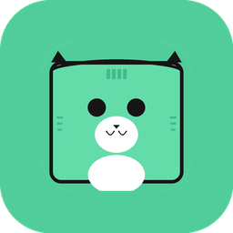
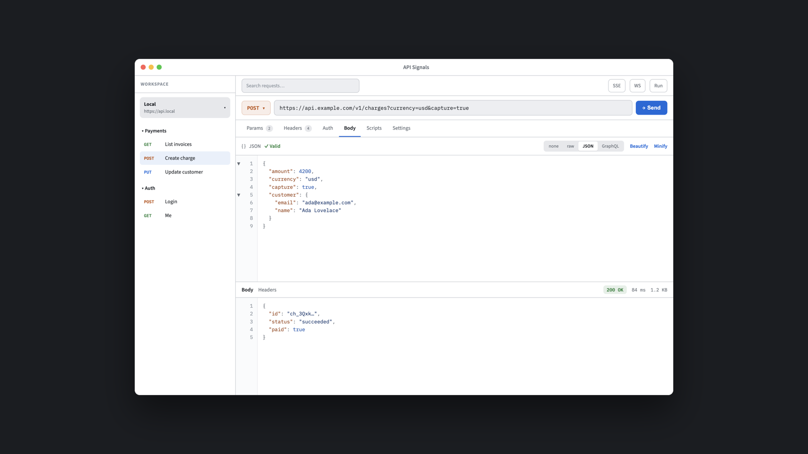
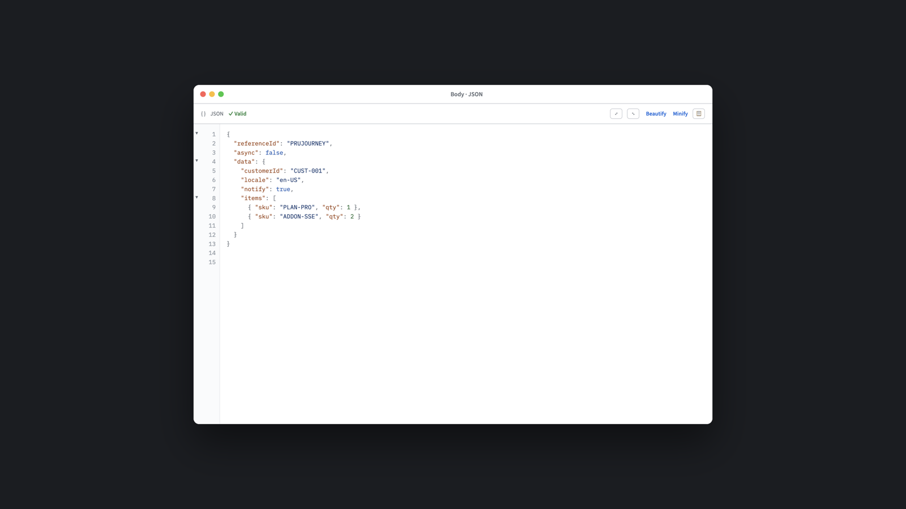
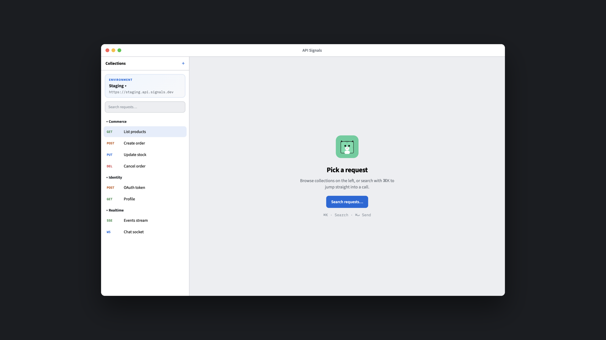

# API Signals

<p align="center">
  
</p>

<p align="center">
  <strong>A native, offline-first API client for macOS</strong><br />
  Fast requests. Local workspaces. No cloud required.
</p>

<p align="center">
  <a href="https://apisignals.github.io/api-signals/">Landing page</a> ·
  <a href="#build-macos">Build</a> ·
  <a href="#features">Features</a> ·
  <a href="https://github.com/apisignals/api-signals">GitHub</a> ·
  <a href="#license">License</a>
</p>

---

**API Signals** is an open-source Postman-style API client that runs as a real native macOS app. Collections, environments, history, and scripts stay on your machine in SQLite — exportable anytime as plain files.

Windows support is planned; the macOS app is the active product surface today.

## Screenshots

<p align="center">
  
</p>

<p align="center">
  
  &nbsp;
  
</p>

## Features

- **Request editor** — method, full URL with query sync, headers, params, auth, body
- **Bodies** — raw, JSON (fold + validate + beautify), form-data, URL-encoded, GraphQL
- **Auth** — Bearer, Basic, API Key, OAuth 2.0, and more
- **cURL paste** — drop a multiline `curl` into the URL bar and fill the form
- **Response viewer** — status, timing, size, pretty JSON, headers, cookies
- **Workspaces** — collections, folders, environments, `{{variables}}`
- **Import / export** — Postman Collection v2.1, OpenAPI, HAR, native `.apisignals.json`
- **Realtime** — WebSocket and Server-Sent Events
- **Scripts** — pre-request / test scripts (`pm.*` subset)
- **Offline-first** — GRDB / SQLite, no account required

## Platforms

| Platform | Status | Stack |
|---|---|---|
| **macOS** | Active (MVP+) | Swift 6, SwiftUI, AppKit, GRDB |
| **Windows** | Planned | C#, WinUI 3 |

## Build (macOS)

Requires macOS 14+ and Xcode / Swift 6 toolchain.

```bash
cd macOS
swift build
cp -f .build/debug/APISignalsApp APISignals.app/Contents/MacOS/APISignals
codesign --force --deep --sign - APISignals.app
open -n APISignals.app
```

Run tests:

```bash
cd macOS
swift test
```

Or open the package in Xcode and run the `APISignalsApp` scheme.

## Repository layout

```
api-signals/
├── docs/                 # Landing page (GitHub Pages)
├── macOS/                # Native macOS app (SwiftPM)
│   ├── Sources/          # Core, Network, Persistence, Scripting, UI, App
│   ├── Tests/            # Unit tests
│   ├── Resources/        # App icon
│   └── APISignals.app/   # Runnable app bundle
├── windows/              # Windows app (planned)
├── README.md
└── LICENSE
```

## Landing page

The product site lives in [`docs/`](./docs/index.html). Enable **GitHub Pages** (Settings → Pages → Deploy from branch → `/docs`) to publish at `https://apisignals.github.io/api-signals/`.

## Contributing

Issues and PRs are welcome. Prefer small, focused changes. Run `swift test` in `macOS/` before opening a PR.

## License

[MIT](./LICENSE) © 2026 API Signals Contributors
