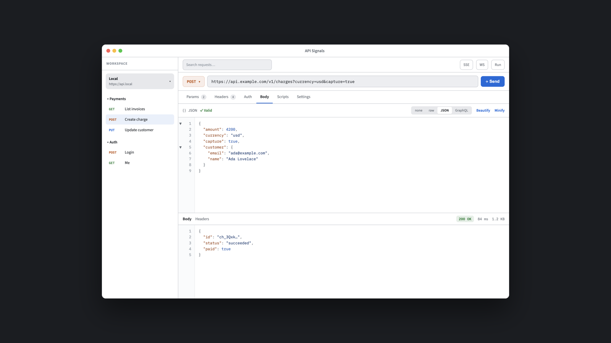
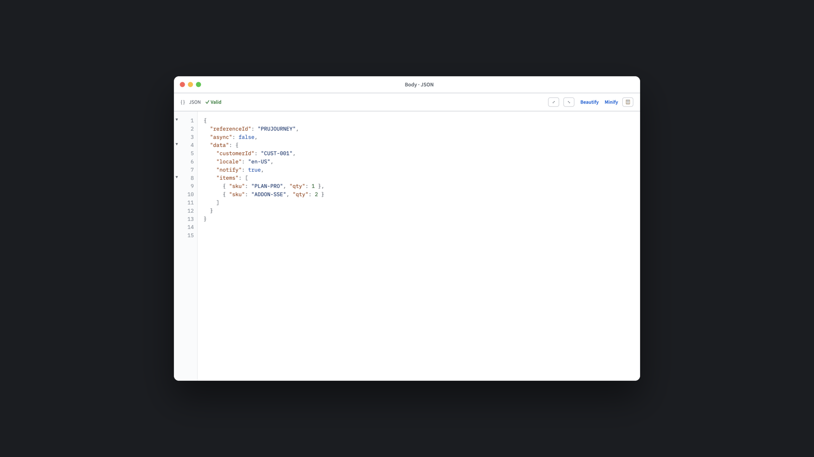
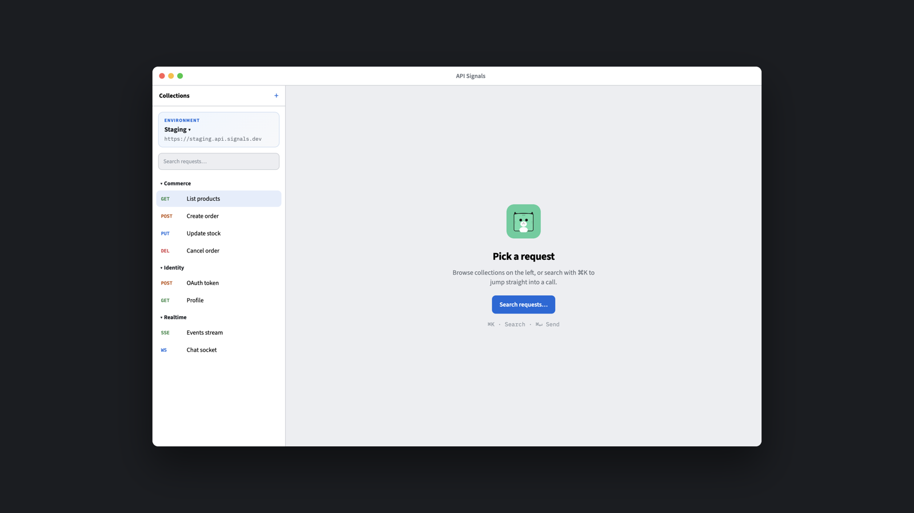

# API Signals

<p align="center">
  
</p>

<p align="center">
  <strong>A native, offline-first API client for macOS and Windows</strong><br />
  Fast requests. Local workspaces. No cloud required.
</p>

<p align="center">
  <a href="https://github.com/apisignals/api-signals/actions/workflows/ci.yml"></a>
  <a href="https://github.com/apisignals/api-signals/releases"></a>
  <a href="./LICENSE"></a>
</p>

<p align="center">
  <a href="https://apisignals.github.io/api-signals/">Landing page</a> ·
  <a href="./docs/README.md">Documentation</a> ·
  <a href="#quick-start">Quick start</a> ·
  <a href="#features">Features</a> ·
  <a href="https://github.com/apisignals/api-signals/releases">Downloads</a> ·
  <a href="./docs/CONTRIBUTING.md">Contributing</a>
</p>

---

**API Signals** is an open-source Postman-style HTTP client built with [Tauri 2](https://v2.tauri.app/) (React + Rust). Collections, environments, history, and scripts stay on your machine in SQLite — exportable anytime as plain files.

| Platform | Installers (releases) | Build from source |
| --- | --- | --- |
| **macOS** (Apple Silicon + Intel) | `.dmg`, `.app` | [docs/BUILD.md](./docs/BUILD.md#macos) |
| **Windows** (x64) | `.msi`, `.exe` (NSIS) | [docs/BUILD.md](./docs/BUILD.md#windows) |

Pre-built binaries appear on [GitHub Releases](https://github.com/apisignals/api-signals/releases) when maintainers push a tag matching `release-v*.*.*` (see [docs/RELEASE.md](./docs/RELEASE.md)).

## Screenshots

<p align="center">
  
</p>

<p align="center">
  
  &nbsp;
  
</p>

## Features

- **Request editor** — method, URL with query sync, headers, params, auth, body
- **Bodies** — raw, JSON (fold + validate + beautify), form-data, URL-encoded, GraphQL
- **Auth** — Bearer, Basic, API Key, OAuth 2.0, and more
- **cURL paste** — drop a multiline `curl` into the URL bar and fill the form
- **Response viewer** — status, timing, size, pretty JSON, headers, cookies
- **Workspaces** — collections, folders, environments, `{{variables}}`
- **Import / export** — Postman Collection v2.1, OpenAPI, HAR, native `.apisignals.json`
- **Realtime** — WebSocket and Server-Sent Events
- **Scripts** — pre-request / test scripts (`pm.*` subset)
- **GraphQL** — schema introspection, syntax highlighting, field autocomplete
- **Mock server** — local HTTP stubs (method, path, status, body)
- **Offline-first** — SQLite in the app data directory; no account required

## Quick start

### Download (recommended)

1. Open [Releases](https://github.com/apisignals/api-signals/releases).
2. Download the asset for your OS (macOS `.dmg` or Windows `.msi` / `.exe`).
3. On macOS, open the app from Applications; on first launch you may need to allow the app in **System Settings → Privacy & Security**.

### Develop locally

**Requirements:** Node.js 20+, Rust 1.77+ ([rustup](https://rustup.rs/)), platform tools below.

```bash
cd tauri
npm ci
npm run tauri dev
```

| OS | Extra requirements |
| --- | --- |
| macOS | Xcode Command Line Tools (`xcode-select --install`) |
| Windows | [WebView2](https://developer.microsoft.com/en-us/microsoft-edge/webview2/) (usually preinstalled on Windows 11), Visual Studio Build Tools with C++ workload |

Production bundles:

```bash
cd tauri
npm run tauri build
```

Details: [docs/BUILD.md](./docs/BUILD.md).

## Repository layout

```
api-signals/
├── tauri/                 # Tauri app (React UI + Rust backend) — primary product
│   ├── src/               # Frontend (React, TypeScript)
│   └── src-tauri/         # Rust commands, SQLite, HTTP engine
├── docs/                  # Project docs + GitHub Pages landing site
├── wiki/                  # GitHub Wiki source pages (sync instructions inside)
├── macOS/                 # Legacy native Swift app (reference; not the release target)
├── .github/workflows/     # CI (PR/main) and release (tags)
├── README.md
└── LICENSE
```

## Documentation

| Topic | Location |
| --- | --- |
| Doc index | [docs/README.md](./docs/README.md) |
| Build macOS & Windows | [docs/BUILD.md](./docs/BUILD.md) |
| Architecture | [docs/ARCHITECTURE.md](./docs/ARCHITECTURE.md) |
| Roadmap | [docs/ROADMAP.md](./docs/ROADMAP.md) |
| Contributing | [docs/CONTRIBUTING.md](./docs/CONTRIBUTING.md) |
| Releases & tagging | [docs/RELEASE.md](./docs/RELEASE.md) |
| Wiki (GitHub) | [wiki/Home.md](./wiki/Home.md) · [wiki/README.md](./wiki/README.md) |
| Security | [SECURITY.md](./SECURITY.md) |
| Code of conduct | [CODE_OF_CONDUCT.md](./CODE_OF_CONDUCT.md) |

## CI / release pipeline

- **CI** ([`.github/workflows/ci.yml`](./.github/workflows/ci.yml)) — on every push/PR to `main`: frontend tests, `cargo test`, then Tauri builds on **macOS** (universal) and **Windows**.
- **Release** ([`.github/workflows/release.yml`](./.github/workflows/release.yml)) — on tag `release-v*.*.*`: same matrix, uploads `.dmg` / `.msi` / `.exe` to a GitHub Release.

## Contributing

Issues and pull requests are welcome. Read [docs/CONTRIBUTING.md](./docs/CONTRIBUTING.md), run `npm test` in `tauri/` and `cargo test` in `tauri/src-tauri/` before opening a PR.

## License

[MIT](./LICENSE) © 2026 API Signals Contributors
